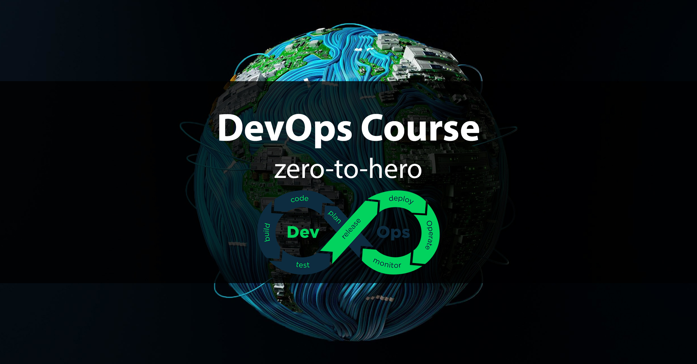

## DevOps Course - Zero to Hero
Prepare you for a real DevOps job!
* all the concept you need as a DevOps Engineer
* all the tool you need to build whole DevOps precess
### Concepts & Hands-On Demos
* Operating System
* Version Control
* Build Tools
* Artifact Repository Manager
* CI/CD
* Cloud - laaS
* Infrastructure Provisioning
* Programming
* Containers
* Container Orchestration
* Configuration Management
* Monitoring
### Learn complete DevOps Pipeline
test -> build -> deploy -> configure -> monitor

### Tip for learning
you learn the most when you use the tools

  <h3> DevOps Course: Zero to Hero - Introduction to Devops</h3>
  
  

  Author:
  <a href="https://www.linkedin.com/in/homadb/" target="_blank">Homayoun</a> 
  

### Introduction to DevOps

#### Overview and Concept explained 
* different roles with different job descriptions
* good overview of own department
* roles and responsibilities of DevOps Engineer ?

#### Software Development Lifecycle
* Plan
* Implement
* Test
* Deploy
* Maintain

### Complete Software Development Process
#### Programming
* software is programmed by developers
* in different programming languages, e.g. Java, Python, JavaScript
* on team per app or per feature

#### Software Testing
* test the new features
* test the old code/fuctionality
* testing is done by developers and dedicated testers
* automated testing

#### Release of Software
* build application
* run on servers
* upgrade existing software

#### Operation
* run software in production

### Traditional: Development vs Operations
#### Development
* programming languages
* test frameworks
* databases
* version control

#### Operations
* OS, mostly Linux
* command-line
* scripting
* monitoring tools

### Solution: DevOps culture
* DevOps was just a way of working between DEV's and OP's
* Common language to communicate
* Became its own role and job

### DevOps tasks and responsibilities
* needs some know-how from DEV and OP's team
* additional DevOps specificskills and know-how

### Waterfall vs. Agile
* influences speed and process of software development
* the way on organization is developing applications

#### Traditional WATERFALL
* Requirements: plan everything beforehand
* Development: developers code complete app
* Testing: testing after everything has developed
* Operations: huge perparation
* ineffective process:x:
* over time new requirments may arise:x:
* many places of failure and miscommunicatin:x:
* no fast feedback:x:

#### Benefits of Agile
* speed of development, testing and deployment cycles:white_check_mark:
* each feature gets tested, deployed
* immediate feedback
* fast development and deployment process
* scrum and kanban - specific implementations

